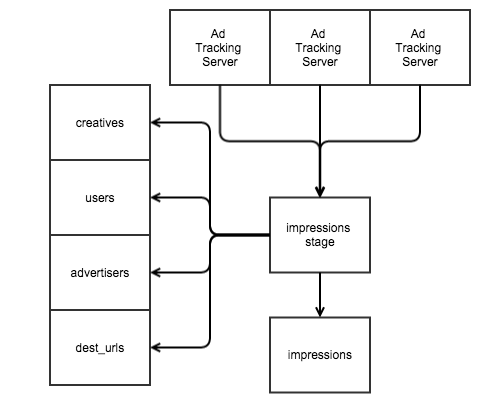
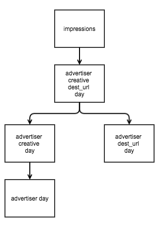
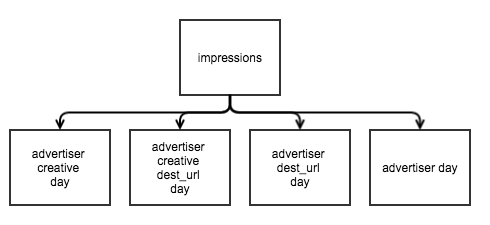
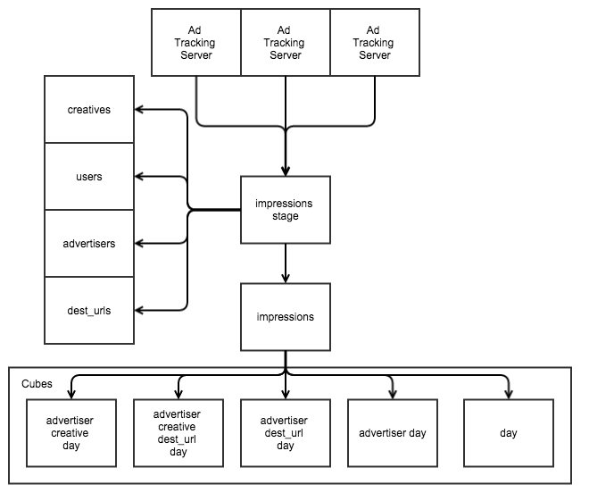

# OLAP Stream Processing
## A Data Whathouse?

A data warehouse is a structure for consuming, organizing, storing, and reporting on data. The most common form of data warehousing today is the snowflake schema OLAP data warehouse. These warehouses are broken down into "facts" and "dimensions" (both defined later), with reporting being handled by a full or partial "OLAP Cube" (also defined later).

The data warehouse is populated via an "ETL" process: by extracting data from various places, transforming it into useful and efficient forms, and loading it into tables. However, the most important function of a data warehouse is reporting:  turning "big data" into "small information" that can be consumed and acted upon. All other actions represent the necessary "costs" of running a data warehouse.

## The Example

Let's work out the costs of running a data warehouse. Data processing is often I/O bound because the datasets are much larger than can fit in memory, so CPU costs will be almost entirely neglected. Note that an I/O bound system can often benefit from spending a few CPU cycles compressing data, but we will neglect that for now. Instead, we will just focus on how much data needs to be moved around.

Let's examine a relatively well understood use case: tracking ad impressions for brand awareness advertising. This ignores clicks, conversions, and several other important features of actual advertising. Additionally, let's use an ad DSP (Demand Side Platform) serving 400,000 ad impressions/second for a total of 34.5 billion impressions/day. On average, the DSP works with 1000 advertisers who on average have 10 destination URLs and 100 creatives. There's also 20 billion internet enabled devices for this example, and all of them eventually see an ad from this DSP.

The ad tracking servers are emitting JSON formatted events that look like this:

    {
        "imp_id": "6076f140-ea53-47f5-a48f-8d1ea0ddc856",
        "advertiser": "Facebook",
        "user": "abc02c1c-9a70-4b8f-8b3b-7d480e3a21ae",
        "imp_time": 1424413670,
        "cost": 0.0000001,
        "creative": "http://www.facebook.com/some_creative.png",
        "dest_url": "https://www.facebook.com/wizzat"
    } // 284 bytes (round up to 300

In the example, this ad impression data streams from the ad servers to a centralized location where it resides on disk ready to be processed once per day. SQL is exceedingly common for expressing data processing in data warehousing, so it will also form the basis for many of the examples here. The stage table schema the data would be dumped into throughout the day would look like this:

    CREATE TABLE impressions_stage (
        imp_id UUID,         -- A unique ID
        advertiser VARCHAR,  -- Whose ad was seen saw
        user VARCHAR,        -- Who saw the ad
        imp_time TIMESTAMP,  -- When we displayed the ad
        cost MONEY,          -- How much it cost to display
        creative VARCHAR,    -- Which specific picture/text was seen
        dest_url VARCHAR     -- Where we tried to send them
    ); -- 16+(4+12)+(4+36)+8+8+(4+41)+(4+31) = 168 bytes

To get an idea of scale, the raw impressions for a single day (assuming 300 bytes each) would take would take ~10.4tb. Once compressed into the stage table, it would fall to 5.8tb. The final form of basic fact data should look something like this:

    CREATE TABLE impressions (
        ad_id         UUID NOT NULL,      -- A unique ID
        imp_time      TIMESTAMP NOT NULL, -- When we displayed the ad
        user_id       BIGINT NOT NULL,    -- Who saw the ad
        advertiser_id BIGINT NOT NULL,    -- Whose ad they saw
        creative_id   BIGINT NOT NULL,    -- What specific picture/text they saw
        dest_url_id   BIGINT NOT NULL,    -- Where we tried to send them
        cost          MONEY NOT NULL,     -- How much we paid
    ); -- 16+8+8+8+8+8+8=64 bytes/row

    {
        "imp_id": "6076f140-ea53-47f5-a48f-8d1ea0ddc856",
        "advertiser_id": 1,
        "user_id": 207,
        "imp_time": 1424413670,
        "cost": 0.0000001,
        "creative_id": 2243,
        "dest_url_id": 4
    }

It should be immediately obvious that several fields changed from strings to integers. This happened because they are dimensions: that is that they are relatively low cardinality fields that express metadata about a fact.  They make processing easier and faster while simultaneously making managing metadata possible. They are also useful for space savings: long and computationally inefficient strings are normalized and replaced by efficient constant sized integers. Check out star schemas and snowflake schemas on Wikipedia for more information.

In our particular example: the number of advertisers, creatives, and destination URLs is very low. The number of users is comparatively very high, but still trivial next to the number of ad impressions per day. Additionally, users as metadata is critical to any advertising business hoping to display relevant ads. The act of normalizing the data compresses the ~10.4tb of raw data per day down to ~2.2tb into the actual warehouse.

## The Batch ETL Process

It is necessary to consider how the raw data is processed into actual facts when calculating the cost of the data warehouse. Any sensible ad system will have access to most of the dimensions mentioned here at ad serving time, however most data warehouses aren't going to be that tightly coupled with the raw dataset. Thus, we will go through the act of extracting dimensions and partitioning the dataset directly.

In this case, the data on the ad tracking servers is periodically collected and copied into the stage table in the data warehouse throughout the day. This is a linear cost across the raw dataset that's pretty unavoidable. This cost may end up being paid more than once for a particular block of ads if any load fails because data delivery must be on an "exactly once" or "at least once" semantic. That means that data may be (exactly) duplicated inside the stage table.

Once the data is in the stage table, missing dimensions need to be created. There's a linear cost for scanning the stage table for each dimension, as well as the cost for scanning the dimension tables. Because the total number of elements in the dimension tables is so small, the I/O cost for scanning them is going to be neglected.

Once the dimension keys exist for all of the data in the stage table, it's ready to be inserted into the fact table. Inserting into a fact table in a data warehouse is usually more complicated than a simple insert. Instead, the data must be carefully checked to ensure that it is inserted into the correct partition. Partitions act as "sub tables" that naturally divide the search space for queries and prevent indexes from getting too large.

This is also the last step where duplicate data can be taken care of before corrupting the fact data. It's generally trivial enough to group by all fields or provide a distinct operator. Either one generally results in a `n log n` sort of the underlying dataset, so this step can be expensive on the read side as well as for writing. Here's a visualization of what the data flow looks like so far:

Some efficiency (but not a lot) in this sample ETL has been sacrificed to illustrate these concepts:

    -- Load the raw data into the stage table. The exact semantics
    -- for this will vary greatly based on the actual DB in use.
    -- Cost = 10.4tb read + 5.8tb write
    COPY TABLE impressions_stage FROM '/home/worker/new_imps' FORMAT JSON;

    -- Find missing dimension values. This will need to be done for
    -- each dimension.
    -- Cost = 5.8tb * 4 dimensions = 23.2tb read
    INSERT INTO users (cookie)
    SELECT DISTINCT user
    FROM impressions_stage
    WHERE user NOT IN (
        SELECT cookie
        FROM users
    );

    -- We know this data represents all data for the
    -- current partition, so we can avoid an extra
    -- linear scan to determine partitioning. This is
    -- safe-ish in this use case.
    -- Cost = 14.7tb read + 2.2tb write
    INSERT INTO impressions (
        ad_id, imp_time, cost, advertiser_id,
        user_id, creative_id, dest_url_id
    )
    SELECT DISTINCT
        stg.ad_id                 AS ad_id,
        stg.imp_time              AS imp_time,
        stg.cost                  AS cost,
        advertisers.advertiser_id AS advertiser_id,
        users.user_id             AS user_id,
        creatives.creative_id     AS creative_id,
        dest_urls.dest_url_id     AS dest_url_id
    FROM impressions_stage stg
        INNER JOIN users ON users.cookie = stg.user
        INNER JOIN creatives ON creatives.url = stg.creative
        INNER JOIN dest_urls ON dest_urls.url = stg.dest_url
        INNER JOIN advertisers ON advertisers.name = stg.advertiser
    ;
    -- Empty it out for the next day. This only cost at the filesystem
    -- metadata layer.
    TRUNCATE TABLE impressions_stage;

    -- Total cost: 48tb read, 8tb write = 56tb I/O cost

As long as the fact update rate matches the fact partition interval, the 56tb I/O cost is fairly constant for a day no matter how many times the ETL runs. If the ETL runs less frequently, an additional scan per fact partition skipped will be required. If it runs more frequently, an additional scan of the entire existing fact partition will be required per run. An example: updating a daily partition once per hour would take the cost from 56tb to almost 82tb (an additional cost of `11.5 * 2.2tb = 25tb`.

## OLAP Reporting

While a tremendous amount of effort goes into making sure that the data warehouse contains all of the data and that the data is high quality, so much more effort is expended in getting data out of it. That's because reporting is the heart of what any data warehouse is used for. The most popular form of reporting in data warehouses is OLAP (OnLine Analytical Processing). It's a technique that optimizes answering large multidimensional analytical queries. OLAP systems are typically updated via batches of large bulk updates because many small updates are very inefficient.

OLAP systems are generally broken down into two kinds of fields: dimensions and measures. Dimensions are fields that make sense to group by such as day, advertiser, or creative. Measures are fields that it doesn't really make sense to group by, such as users and total cost. Measures generally have a specific calculation associated with them, and in the example `num_users` is calculated via `count(distinct)` and `cost` is calculated via `sum`.

As a general rule, OLAP consists of the following three operations:
* Rollups
* Drill Downs
* Slicing and Dicing

Let's take a moment and understand what that means. Pulling an advertiser performance by day report for the last week out of the example impressions table is simple:

    SELECT
        imp_time::date          AS day,
        advertiser_id           AS advertiser_id,
        COUNT(distinct user_id) AS num_users,
        COUNT(*)                AS num_imps,
        SUM(cost)               AS cost
    FROM impressions
    WHERE imp_time::date >= current_date-7
    GROUP BY 1, 2
    -- Cost = 2.2tb * 7 = 15.4tb

Now, suppose that the advertiser performance by day report is showing a peculiarity in the data; maybe a particular advertiser has a huge uptick in impressions mid way through the week. It's impossible to use the high level data to know what's driving the change. A common approach to finding out what drove the uptick is to "drill down" to a lower granularity and look at the advertiser's specific advertising performance:

    SELECT
        imp_time::date          AS day,
        dest_url_id             AS dest_url_id,
        COUNT(distinct user_id) AS num_users,
        COUNT(*)                AS num_imps,
        SUM(cost)               AS cost
    FROM impressions
    WHERE imp_time::date >= current_date-7
        AND advertiser_id = 4
    GROUP BY 1, 2, 3
    -- Cost = 2.2tb * 7 = 15.4tb

Any particular view of the data may not explain the performance irregularity, so oftentimes its important to be able to look at the data from different perspectives ("dicing" it). Replacing `dest_url_id` with `creative_id` might reveal that the advertiser started a new ad campaign with several new creatives. Oftentimes it's important to be able to "slice" data away (exclude it) to get a better view of the "natural" performance:

    SELECT
        imp_time::date          AS day,
        advertiser_id           AS advertiser_id,
        COUNT(distinct user_id) AS num_users,
        COUNT(*)                AS num_imps,
        SUM(cost)               AS cost
    FROM impressions
    WHERE imp_time::date >= current_date-7
        AND creative_id NOT IN (17, 18, 19, 20)
    GROUP BY 1, 2
    -- Cost = 2.2tb * 7 = 15.4tb

At its core, OLAP is all about having the ability to answer nearly arbitrary questions about the data by rolling it up to higher aggregations, drilling down to lower ones, shifting perspective, and removing outliers.

## OLAP Aggregates

In an ideal and simplistic world, the reports in an OLAP system would always be run against the "base fact" tables. However, through the process of digging through just one set of questions we burned through a completely preposterous 62 tb of disk I/O. In the real world, the fact data is often "rolled up" into aggregate or summary tables to store the result of these queries so that they can be used many times.

Supporting the full definition of OLAP (rollups, drill downs, and slicing/dicing) requires an aggregate table for every dimension combination for a total of `2**n` aggregates. Precomputing and storing the data along every combination of dimensions is often called "cubing" the data, and the computed dataset is often called an "OLAP Cube".

To make things more complicated, time series data often comes with several "hidden" dimensions because people often want the data rolled up by week, month, quarter, and year. Because the time dimension is guaranteed to exist, it's often easiest to think of having 5 cubes of `2**(n-1)` size. For the example dataset there are 4 dimensions (including time), so the required number of aggregates would be `2**(4-1)*5=40` aggregates.

This is an example ETL that calculates one of the 40 required aggregate tables:

    -- Executed once, ever
    CREATE TABLE imps_by_advertiser_day (
        day           DATE NOT NULL,
        advertiser_id BIGINT NOT NULL,
        num_users     BIGINT NOT NULL,
        num_imps      BIGINT NOT NULL,
        cost          MONEY NOT NULL,
        --
        PRIMARY KEY(day, advertiser_id)
    );

    INSERT INTO imps_by_advertiser_day (
        day, advertiser_id, num_users, num_imps, cost
    )
    SELECT
        imp_time::date          AS day,
        advertiser_id           AS advertiser_id,
        COUNT(distinct user_id) AS num_users,
        COUNT(*)                AS num_imps,
        SUM(cost)               AS cost
    FROM impressions
    WHERE imp_time::date = current_date
    GROUP BY 1, 2;
    -- Cost = 2.2tb

It may seem like processing the dataset so many times is inefficient, but as with any mature technique, there are always a myriad of ways to optimize it. One of the most important ways to optimize processing is by utilizing knowledge of the business domain. For our example, it almost never makes sense to create reports that group by creative or destination URL without also including advertiser. This allows us to cut 3 of the 8 potential aggregate tables per cube down to only 5.

Additionally, it is sometimes possible to use "low level" aggregations grouped by more dimensions as a data source for building "high level" aggregations grouped by some subset of dimensions. These relationships are often chained to produce a hierarchy tuned for delivery time or minimal cost.

This relationship is only possible when the stored in the aggregate table isn't a scalar representing a non-scalar data type. That is to say: it isn't count(distinct) or quantile data stored as numbers. Unfortunately for us, the users measure is calculated via count(distinct) and therefore our entire OLAP cube must be calculated directly from the fact table. This kind of layout looks like this:

Let's do some quick math to figure out how big the aggregate tables are going to be. The time and measures fields are all 8 byte numbers, so there's a constant cost of 32 bytes per row. After that, it's 8 bytes for every extra group by.  So the table sizes should be something like this:
* `imps_by_day`, 1 row per day * 32 bytes/row = 32 bytes/day
* `imps_by_advertiser_day` 1k rows/day * 40 bytes/row = 40kb/day
* `imps_by_advertiser_creative_day`, 100k rows/day * 48 bytes/row = 4.8mb/day
* `imps_by_advertiser_dest_url_day`, 10k rows/day * 48 bytes/row = 480kb/day
* `imps_by_advertiser_creative_dest_url_day` 1m rows/day * 54 bytes/row = 54mb/day

With the actual aggregation sizes being so small, they're almost wholly neglectable. The costs of building the cubes out is:
* Daily: 2.2tb * 5 tables * 1 day = 11tb
* Weekly: 2.2tb * 5 tables * 7 days = 77tb
* Monthly: 2.2tb * 5 tables * 30 days = 330tb
* Quarterly: 2.2tb * 5 tables * 90 days = 990tb
* Yearly: 2.2tb * 5 tables * 365 days = 4pb
* Total: 4pb + 990tb + 330tb + 77tb + 11tb = 5.4pb

It's pretty obvious that most of the really heavy costs start kicking in at the monthly aggregation tier. These costs are so painful and expensive that oftentimes businesses do without necessary information just because it costs too much to calculate it. For this example, we're going to assume that YTD and Year over Year reports are critical metrics to deliver for our advertisers, so we're going to deliver them.

However, in a fast paced business world, decisions often need to be made more quickly than is allowed by updating performance data merely once per day. The cost for the daily cube sees a 12.5x leap in cost, but most of the others increase by a factor of 24. The daily cube costs less because the early aggregations have so much less to do. Just to make these numbers explicit, the cost of updating performance data hourly rises to:
* Daily: 11tb -> 138tb (2% total increase)
* Weekly: 77tb -> 1.8pb (36% total increase)
* Monthly: 330tb -> 8pb (282% total increase)
* Quarterly: 990tb -> 23.8pb (720% total increase)
* Yearly: 4pb -> 96.4pb (2497% total increase)
* Total: 5.4pb -> 130pb (2428% total increase)

It should be pretty apparent that updating all of the cubes every hour is completely impractical. It's much more possible to update just the daily and weekly aggregates once per hour and update the rest once per day. That would increase the processing cost to merely 7.4pb of I/O per day. However, that's likely to lower confidence in the quality of the data warehouse and generate a never ending stream of bug reports when the daily cube has updated with the results of an advertising campaign but the monthly hasn't yet.

Additionally, 7.4pb of I/O cost in a processing pipeline is no joke, even if almost all of it's reading. To put that in perspective, using ultra high end SSDs (2.5tb, 3000 MB/s seq read, $28k ea), it would take 2.5 million disk-seconds (29 disk days!) to fetch the data and process just one day of data. It's much more likely to take 713 disk-days using conventional HDDs at 120MB/sec seq read. It just boggles the mind that 10.4tb of input data resulted in 7.4pb of I/O cost.

Before we give up entirely on this appraoch, it's worth looking at optimizations that we skipped. For instance, we weren't able to build our tables hierarchically because of the `num_users` measure. Is that measure _*REALLY*_ necessary? The customers will be pretty insistent on having it, so another solution is needed. As it turns out, Google published the HyperLogLog++ paper for estimating the number of uniques instead of actually counting them directly. It has the advantage that unions are easy, but intersections are _risky_. Storing HyperLogLog++ in the aggregate tables would increase the cost of a row by 2500 bytes, so the tables would look something like this:
* `imps_by_advertiser_creative_dest_url_day` 1m rows/day * 2554 bytes/row = 2.5gb/day
* `imps_by_advertiser_creative_day`, 100k rows/day * 2548 bytes/row = 255mb/day
* `imps_by_advertiser_dest_url_day`, 10k rows/day * 2548 bytes/row = 25.5mb/day
* `imps_by_advertiser_day` 1k rows/day * 2540 bytes/row = 2.54mb/day
* `imps_by_day`, 1 row per day * 2532 bytes/row = 2.5kb/day

However, the only table that would be required to be built from the impressions table is `imps_by_advertiser_creative_dest_url_day`. All others - even the source tables for the higher level aggregations - could be built from it. The cost matrix becomes:
* `imps_by_advertiser_creative_dest_url_day`: 27.5tb + 2.5gb
* `imps_by_advertiser_creative_day`: 2.5gb + 255mb
* `imps_by_advertiser_dest_url_day`: 2.5gb + 25.5mb
* `imps_by_advertiser_day`: 25.5mb + 2.54mb
* `imps_by_day`: 2.54mb + 2.5kb

The total cost matrix after switching to hourly builds, HLL++ for uniques, and hierarchical aggregation builds would become:
* Fact Processing: 56tb
* Daily: 27.tb
* Weekly: 25.3gb (Built from daily)
* Monthly: 83gb (Built from daily)
* Quarterly: 15gb (Built frmo monthly)
* Yearly:  38gb (Built from monthly)
* Total: 83tb

I/O costs going from 74pb to 83tb really puts a spot light on how painful `count(distinct)` is as a problem. Despite how much better 83tb in I/O cost per day feels, it still seems pretty outrageous considering only 10.4tb of raw data came into the system. I think we can do better.

## Stream Processing for Faster Processing

Let's take a step back and look at the batch processing system from the very beginning and consider the wasted steps, and how to optimize them away. This is what the data flow for this warehouse currently looks like:

The first point of obvious inefficiency is that we have to scan `impressions_stage` for each dimension in the impressions table. Additionally, the cost of building the first HLL aggregate table is tremendous. Furthermore, the need for more up to date data never seems to go away. It would be ideal to solve all of these problems simultaneously.

Stream processing is the idea of taking a (potentially never ending) "stream" of data and applying operations to every element of the stream. Many of these operations can be done in parallel, while others may require some ordering. Here's an example of stream processing that illustrates both parallel and sequential steps:

    def process_user(imp_event):
        imp_event.user_id = UserService.lookup(imp_event.user)

    def process_advertiser(imp_event):
        imp_event.advertiser_id = AdvertiserService.lookup(imp_event.advertiser)

    def process_creative(imp_event):
        imp_event.creative_id = CreativeService.lookup(imp_event.creative)

    def process_dest_url(imp_event):
        imp_event.dest_url_id = DestUrlService.lookup(imp_event.dest_url)

    def process_event(imp_event):
        futures.wait([
            executor.submit(process_user, imp_event),
            executor.submit(process_creative, imp_event),
            executor.submit(process_dest_url, imp_event),
            executor.submit(process_advertiser, imp_event),
        ])

        return imp_event

    def process_stream(stream):
        events = []
        committed_offset = stream.offset

        for datum in stream:
            imp_event, offset = datum

            proc_event = process_event(imp_event)
            events.append(proc__event)
            if len(events) >= 62500:
                # Batch size: 18.75mb read, 4mb write
                write_impressions(events)
                events.clear()
                stream.commit(offset)

There are a couple of things to notice here. The first is that the data processing language has shifted from SQL to Python (or any other programming language). It's not that there's something wrong with SQL, it's that current implementations of it are batch oriented and data needs to _flow_. The key advantage of this solution is that the data is read directly from the ad tracking queue and inserted directly into the impressions table - bypassing `impressions_stage` entirely.

A solution like this directly nails the theoretical limit in processing performance on the fact ingestion side: 10.4tb read + 2.2tb write. At first this may seem like fancy wizardry, but the trick is never actually storing the raw data in the data warehouse. All of the expensive scans to find missing dimensions are replaced by constant time calls to a look aside cache service. Missing dimensions still require writes to the database, but they are very targeted and dimension table scans aren't necessary. The magic really comes from only having to look at the impression and its associated metadata once.

However, the above code has a lot more going on than immediately meets the eye. For example, stream processing systems are run in a highly parallel and concurrent manner. The ad tracking servers for the example ad DSP would all be feeding data into the queue simultaneously, while the stream processing consumers would all be pulling simultaneously. Thus, the queue needs to present a _MECE_ (Mutually Exclusive but Collectively Exhaustive) interface for consumption so that consumers can be written with confidence around accessing shared data stores.

Additionally, the _delivery semantics_ of message delivery become incredibly important for a stream processing system. For various reasons mostly relating to distributed atomicity, delivering data exactly once is extraordinarily difficult, and obviously missing data can never be counted at all. That means that a stream processing system relies on a high quality queue with _at least once_ delivery semantics. It's also of vital importance that consumers be written with an eye towards gracefully handling duplicate data.

It may also seem incongruous that a streaming system would batch writes into the fact table. The reason this is true is because sequential disk access for reads and writes is far more efficient than scattered or random disk access. The implication is that periodically we may process an event only to have it fail to insert at a later stage in processing. This means that we would need to replay the data stream starting from before the error happened - meaning that it is critically important that the queue must give checkpoint control to the consumer and be strongly ordered and idempotent across application failures.

Making the stream processor deal with duplicate data can be accomplished in a completely robust way by permanently storing all objects in the data stream under a unique identifier (necessarily provided by the object and not the processor), or in a slightly less robust way by storing the data IDs in short term storage such as memcached or redis and skipping processing for objects that have already been seen.

While this is an obvious improvement in both the cost of and the responsiveness of the ETL pipeline, it's really only half the job. The ultimate goal is to reduce the pain not only for the ETL pipeline, but also for generating and updating the OLAP cube that drives dashboards and reports. To tackle this problem, we first need to consider how to process the OLAP cube. The cube is already populated via HLL++ and hierarchical updates. The largest pain point is updating the first aggregate. In that spirit, it seems possible to update that aggregate at the same time the fact gets updated:

    def create_agg_rows(events):
        rows = collections.defaultdict(FirstSummaryRow)

        for event in events:
            rows[FirstSummaryRow.key(event)].add(event)

        # Generally ~5kb (2-3 rows) should come out of 18.75mb
        write_agg_rows(rows.values())

    def process_stream(stream):
        events = []
        committed_offset = stream.offset

        for datum in stream:
            imp_event, offset = datum

            proc_event = process_event(imp_event)
            events.append(proc__event)
            if len(events) >= 62500:
                # Batch size: 18.75mb read, 4mb write
                write_impressions(events)
                events.clear()
                stream.commit(offset)

// It's also difficult to simply slap a few more steps onto the existing stream processor to update the OLAP cube, because all updates to the cube for a given data object would need to be applied atomically. This may be a supplied feature with some specialized OLAP data stores, but generally atomicity in a distributed system is guaranteed at the individual object level. Instead, it's generally easier and less error prone to let each breakdown of the cube update at its own rate with its own atomicity.
//
// The naive solution - that will absolutely work -  is to setup a stream processor for each dimension combination that all read directly from the output queue of the fact stream processor. This has the advantage of being really fast to write, but has the disadvantage that each stream processor will effective scan the entire dataset once.
//
// Alternatively, it's possible to maintain the directed graph of data dependency from before and dramatically shrink the amount of data required to generate the "higher level" tables that have fewer dimensional slices. This would require more development work, because the basic fact rows would have to be transformed into a common summary row format, including the serialized HLL/LQE structure.
